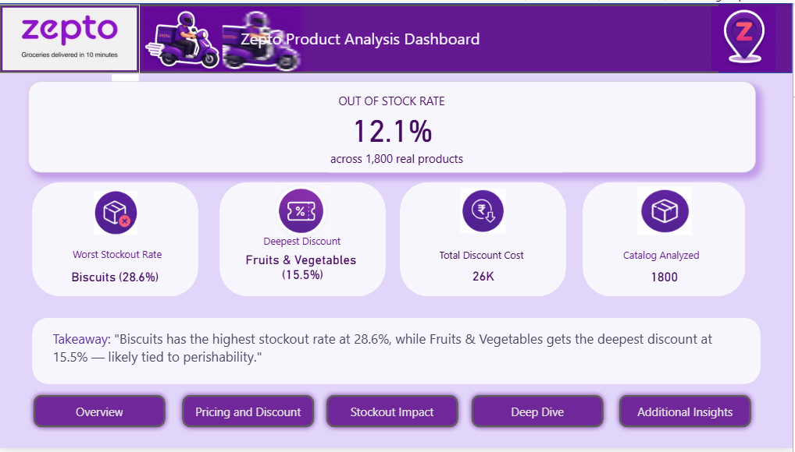
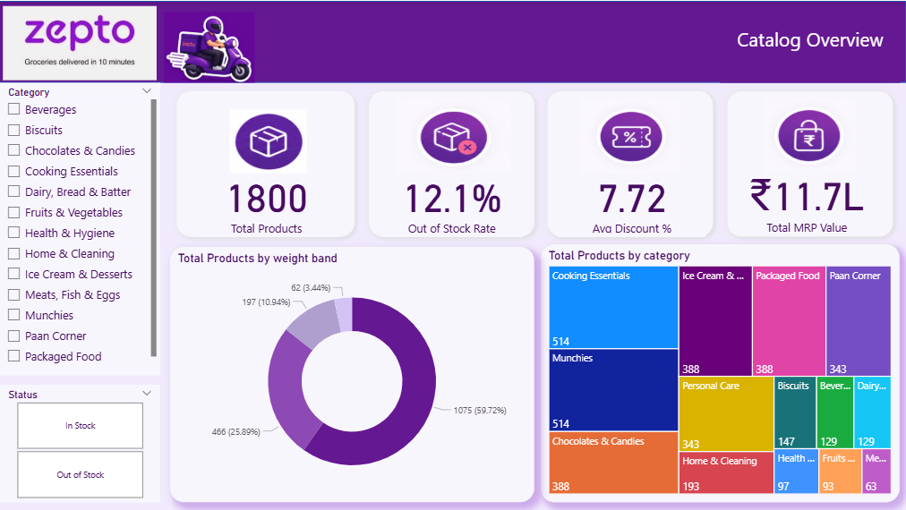
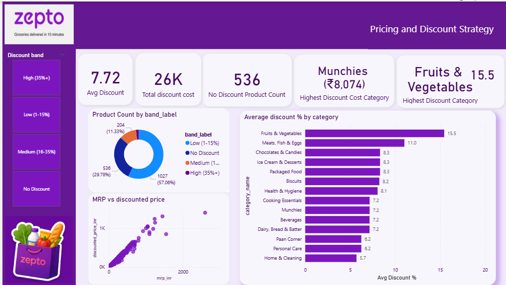
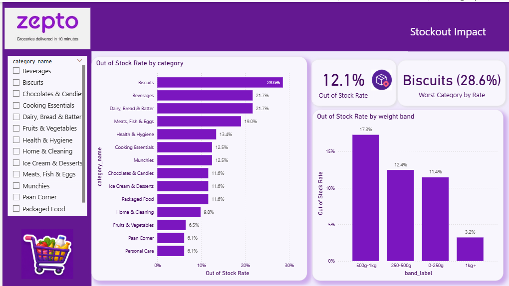
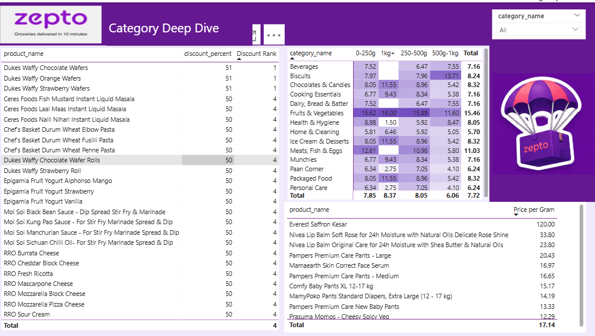
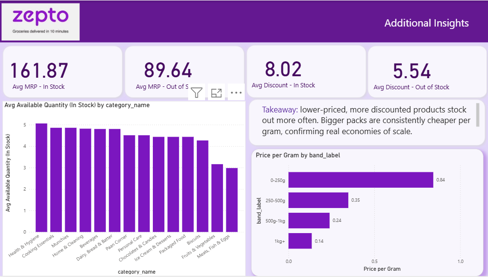

#  Zepto Product Analytics Dashboard

> **An interactive Power BI dashboard that analyzes Zepto's product catalog to uncover pricing trends, discount strategies, inventory health, and category-level business insights.**

---

##  Project Overview

This project transforms Zepto's product catalog into an interactive Power BI dashboard that helps understand inventory availability, discount patterns, product distribution, and pricing strategies.

The dashboard is designed for business users to quickly identify stockout issues, evaluate discount effectiveness, compare product categories, and support data-driven merchandising decisions.

---

#  Dashboard Preview

##  Executive Summary



---

##  Catalog Overview



---

##  Pricing & Discount Strategy



---

##  Stockout Impact Analysis



---

##  Category Deep Dive



---

##  Additional Insights



---

#  Business Objectives

- Monitor overall catalog health.
- Track product availability across categories.
- Analyze pricing and discount strategies.
- Identify categories with high stockout rates.
- Compare discount performance across product categories.
- Discover inventory optimization opportunities.
- Generate actionable business insights through interactive dashboards.

---

#  Dashboard Features

###  Executive Summary
- Out-of-Stock Rate KPI
- Deepest Discount Category
- Total Discount Cost
- Catalog Size
- Executive Takeaways

###  Catalog Overview
- Product Count
- Out-of-Stock %
- Average Discount
- Total MRP Value
- Product Distribution by Category
- Product Distribution by Weight Band

###  Pricing & Discount Strategy
- Average Discount
- Discount Band Analysis
- MRP vs Discounted Price
- Category-wise Discount %
- Highest Discount Categories

###  Stockout Impact
- Category-wise Stockout Rate
- Weight Band Stockout Analysis
- Worst Performing Categories

###  Category Deep Dive
- Product Ranking
- Discount Ranking
- Price Per Gram
- Category Performance Matrix

###  Additional Insights
- Average MRP Comparison
- Average Discount Comparison
- Quantity Analysis
- Price per Gram Analysis
- Business Takeaways

---

#  Key KPIs

| KPI | Description |
|------|-------------|
| Total Products | Overall catalog size |
| Out-of-Stock Rate | Percentage of unavailable products |
| Average Discount % | Average discount across products |
| Total Discount Cost | Total value discounted |
| Total MRP Value | Combined catalog MRP |
| Product Distribution | Category-wise product count |
| Stockout Rate | Category-level inventory analysis |
| Price per Gram | Product value comparison |

---

#  Key Business Insights

- **12.1%** of products are currently out of stock.
- **Biscuits** have the highest stockout rate (**28.6%**), indicating a potential inventory gap.
- **Fruits & Vegetables** receive the highest average discount (**15.5%**), likely due to their perishable nature.
- Most products fall within the **Low Discount (1–15%)** band.
- Larger pack sizes offer a lower **Price per Gram**, providing better value for customers.
- Interactive filtering enables quick exploration of category, pricing, and inventory performance.

---

#  Data Model

The dashboard follows a **Star Schema** data model.

### Fact Table
- Fact_Products

### Dimension Tables
- Category
- Discount_Band
- Stock_Status
- Weight_Band

### Bridge Table
- Bridge_Product_Category

---

#  Tools & Technologies

- Microsoft Power BI
- Power Query
- DAX
- Data Modeling
- Data Visualization
- Microsoft Excel

---

#  Repository Contents

```
README.md
Zepto_Product_Analytics_Dashboard.pbix
Zepto_Dashboard.pdf
page1.png
page2.png
page3.png
page4.png
page5.png
page6.png
Fact_Products.csv
Category.csv
Discount_Band.csv
Stock_Status.csv
Weight_Band.csv
Bridge_Product_Category.csv
```

---

#  Skills Demonstrated

- Data Cleaning
- Data Modeling
- Star Schema Design
- DAX Measures
- Power Query
- KPI Design
- Interactive Dashboard Design
- Business Intelligence
- Data Visualization
- Analytical Storytelling

---

#  Future Improvements

- Sales & Revenue Analysis
- Customer Purchase Behavior
- Supplier Performance Dashboard
- Inventory Forecasting
- Demand Prediction using Machine Learning

---

#  Author

**Chaitali Khot**

Bachelor of Engineering (Computer Science)

Aspiring Data Analyst | Power BI | SQL | Python

---

 If you found this project interesting, consider giving it a star.
